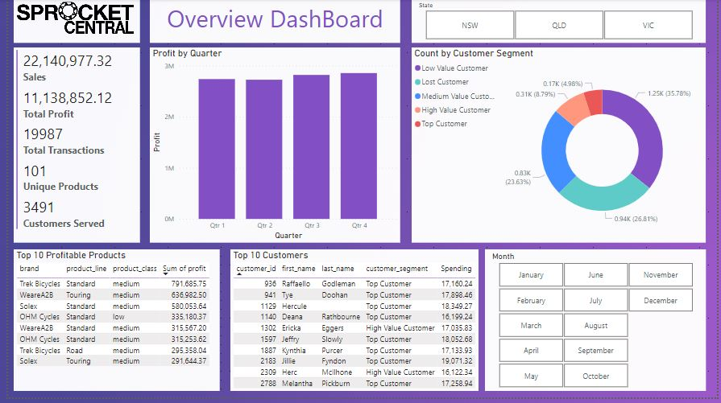
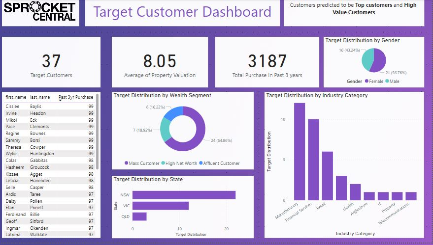

# KPMG Virtual Experience Program.

## Task 1: Data Quality.

Data was analysed for data quality Issues. This issues were documented [here](https://github.com/dalphonorechi/KPMG-Virtual-Experience-Program/blob/main/KPMG-DataQuality.docx).

## Task 2 : Predicting Target Customers.

#### 1.Explore and prepare the dataset.

The dataset was explored and prepared by performing feature engineering, using Recency, Frequency and Monetary value analysis and data transformation. 

#### 2.Train a machine learning model.

I trained a machine learning model to be able to predict the target outcome, if a customer was a target or not. I used LGBM Classifier algorithm that easily allowed the output information about how each variable within the model contributes to its predictive power.

#### 3.Evaluate model and present findings.

After training the model, I evaluated how well it performed by conducting cross-validation and outputting appropriate evaluation metrics. Furthermore, I created a visualisation to interpret how each variable contributed to the model. Finally, I summarised my findings this [Powerpoint Presentation](https://github.com/dalphonorechi/KPMG-Virtual-Experience-Program/blob/main/Module_2.pptx).

## Task 3 : Create Dashboard.

in this task, I used Power BI to create a set of [reports](https://github.com/dalphonorechi/KPMG-Virtual-Experience-Program/blob/main/sprocket_central.pbix)) from the Sprocket Central Customer Data.

